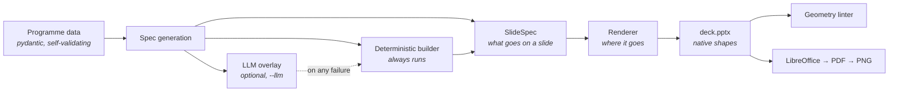

# deckpilot

**Consulting-grade PowerPoint status decks, generated from structured programme data.**

Feed it a transformation programme — work packages, stage gates, a RAID log, weekly
sub-stream reports — and it produces a thirteen-slide deck that a consultant could
take into a steering committee without apologising for it. Every slide is built from
native PowerPoint shapes: the text is selectable, the roadmap bars are draggable, the
RAID log is a real table you can sort. Nothing is an image. It runs end to end with no
API key.


---

## Quickstart

```bash
git clone https://github.com/morichtereur/deckpilot.git
cd deckpilot
python -m venv .venv && source .venv/bin/activate
pip install -e .
deckpilot demo
```

That writes `examples/deck.pptx` and runs the geometry checks over it. No API key,
no network, no configuration.

```
Wrote deckpilot/data/programme.json - 12 sub-streams, 18 RAID items
Wrote examples/deck.pptx - 13 slides (1 x criteria_columns, 1 x exec_summary,
  1 x governance_chart, 1 x raid_table, 1 x roadmap_gantt, 4 x section_divider,
  1 x status_overview, 3 x workstream_charter)
Geometry check: clean.
```

Other commands:

```bash
deckpilot build --data deckpilot/data/programme.json --week 2026-W34 --out deck.pptx
deckpilot build --data deckpilot/data/programme.json --out deck.pptx --llm
deckpilot render-one --layout roadmap_gantt --out single.pptx
```

`render-one` builds a single layout from its sample spec, which is how you work on one
without rebuilding twelve other slides first.

---

## How it works



The pipeline has one load-bearing split: **content decisions and layout decisions never
mix.** A `SlideSpec` says which RAID items appear on a slide and how the action title is
phrased. It says nothing about position, size or colour — those come from
`deckpilot/theme/tokens.py` and are computed by the layout. That is what makes it safe to
let a language model touch the deck at all.

| Module | Responsibility |
|---|---|
| `data/` | The programme model and a hand-authored synthetic dataset |
| `theme/tokens.py` | Every colour, size and grid constant in the project |
| `specgen/` | Deterministic spec builder, plus the optional LLM overlay |
| `renderer/` | One module per layout, over a shared fitting and shape toolkit |
| `renderer/qa.py` | Geometry linter — off-slide, over-margin, colliding, crowded |

---

## Layouts

| | |
|---|---|
| **Workstream charter** — N sub-stream columns crossed by two labelled bands, so a reader can compare one row across every column |  |
| **Roadmap** — month grid, bars coloured by schedule state, milestone diamonds, a reporting-date line, and parallel phases stacked into lanes |  |
| **Status overview** — one card per work package: rating, progress bar, what is happening, what is next |  |
| **RAID table** — a real PowerPoint table, grouped by type, severity carried by the cell fill |  |
| **Governance chart** — three tiers joined by native connectors, each work package split into core and contributing teams |  |
| **Criteria columns** — a question per column and the characteristics that answer it; also covers WHY / WHAT / HOW framings |  |
| **Executive summary** — rated verdict, the messages behind it, the decisions being asked for |  |
| **Section divider** — a full-bleed break, and the only slide in the deck with no footer |  |

---

## Why this is hard

The interesting problem here is not the language model. It is one API call. The
difficulty is that PowerPoint is a fixed canvas and text is not fixed-size, and the
library that writes the file cannot see either.

**python-pptx never renders.** It writes XML. So nothing in the library can tell you
whether a string fits its box. PowerPoint's own autofit is not a way out either: it runs
at open time on the reader's machine, which means the `.pptx` on disk would contain sizes
nobody chose, and two people opening the same file could see different decks. So
`renderer/text_metrics.py` carries Calibri's advance widths and does the wrapping itself.
Every size decision is made at build time and written into the file explicitly.

**Fitting each box on its own produces a slide that looks broken.** One column's header
lands a point smaller than its neighbour's, nothing overflows, and the slide still reads
as a mistake. Peers have to be fitted as a group, at one shared size set by the tightest
member.

**Whitespace has to go somewhere deliberate.** A bulleted list that stops a third of the
way up its box looks like a box that was sized wrong. Leftover height is pushed into the
gaps between bullets, shared across a band so peer columns stay on the same baselines —
and where a block genuinely has less to say than the slide has room, the block is sized
to its content and the page simply ends early. A half-empty box is worse than white space.

**The edges are where roadmaps break.** A bar starting before the window, a bar ending
after it, a one-day task that rounds away to nothing, a milestone on the last day of the
last month, two migration waves that genuinely overlap and must not be drawn on top of
each other. That arithmetic lives in `renderer/timeline.py` on its own precisely so it
can be tested as arithmetic instead of by squinting at a slide.

**A table row height is a minimum, not a maximum.** Set one on a python-pptx table and
PowerPoint will still grow the row if a cell wraps further — and the table walks off the
bottom of the slide. Row heights have to be computed from the wrapped line count.

**Defaults leak.** python-pptx attaches a theme style block to every new autoshape, which
carries a drop shadow. An empty `<a:effectLst/>` suppresses it in PowerPoint but not in
every renderer, so the whole style block is stripped — a deck whose shapes grow shadows
depending on who opens it is not a deck you control.

Then there is the part that only shows up on a screen: white bar labels are unreadable on
the pale "complete" fill and fine on the deep "in progress" one, so label colour is chosen
per fill by WCAG contrast ratio. Every combination in the deck clears 4.1:1.

---

## The LLM path

`--llm` is an overlay, not a generator. The deterministic builder runs first and produces
a complete, valid deck. The model is then asked to do two things: write the action titles,
and choose which RAID items earn a place on each slide.

It chooses RAID items **by id**, never as free text, so it cannot introduce a fact that is
not already in the programme data — and an id belonging to another work package is dropped
rather than moved onto the slide. It does not choose layouts, slide order, or anything
about position.

Every failure path returns the deterministic deck: malformed JSON, a schema violation, an
invented id, a slide that does not exist, a transport error, no API key at all. A failed
response is retried once with its own validation error attached, because a second blind
attempt is just a second coin toss. **The model can improve the deck. It cannot break it.**

No test calls the API, and CI does not need a key.

---

## Quality checks

Two passes, because they catch different faults.

```bash
python scripts/qa.py examples/deck.pptx        # lint the geometry, then render every slide
pytest                                          # 199 tests
ruff check .
```

The **geometry linter** finds what eyes are bad at — a shape three thousandths of an inch
over the margin, two boxes overlapping by four percent, neighbours that nearly touch. It
needs no rendering, so it runs inside the test suite and after every build. Shapes are
named, so it can tell a title and subtitle set deliberately tight from two boxes that
collided (`bleed:` crosses the margin on purpose, `marker:` sits on top of something on
purpose, `surface:` is a background band other content comes right up to).

The **visual pass** finds what only eyes catch. `scripts/qa.py` converts the deck to PDF
with LibreOffice and rasterises each page with CoreGraphics — headless, about four seconds
for a deck, with no GUI application involved. It needs LibreOffice on the path and, on
macOS, `pip install -e '.[qa]'` for the rasteriser.

A shipped deck should produce no `WARNING`s. When text genuinely will not fit its box even
at the minimum size, `fit_text` truncates with an ellipsis and logs the slide and element
by name — that is a content or layout decision to make, not something to hide by clipping.

---

## Development

```bash
pip install -e '.[dev,qa]'
pytest
ruff check .
python -m deckpilot.data.generate     # regenerate the synthetic programme
```

The dataset in `data/generate.py` is hand-authored rather than randomised. A status deck
only reads as real if the RAID log argues with the roadmap and the weekly reports argue
with both, and random generators do not produce that. Only history is derived: each
sub-stream states its current week honestly, and earlier weeks are walked backwards from it.

Everything in it is fictional — "Northwind GBS" is not a company, and none of the people,
teams or numbers are real.

---

## Troubleshooting

**`ModuleNotFoundError: No module named 'deckpilot'` right after `pip install -e .`**
— on macOS, check whether the install's path file has picked up the hidden flag:

```bash
ls -lO .venv/lib/python3.*/site-packages/*.pth
```

`site` silently skips a `.pth` file marked `hidden`, so the editable install is never
put on the path and nothing reports an error. Clear it:

```bash
chflags nohidden .venv/lib/python3.*/site-packages/*.pth
```

**`scripts/qa.py` cannot find LibreOffice** — it looks in `/Applications/LibreOffice.app`
and then on `PATH`. Pass `--no-images` to run the geometry check alone; that half needs
nothing but Python.

---

## Licence

MIT. See [LICENSE](LICENSE).
